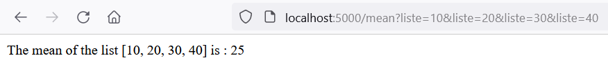
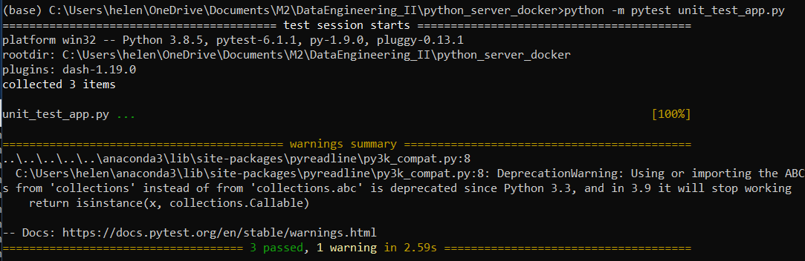

## Hélène Boersma
# Python-Serving-Testing

## Run the python website
In order to test the programme, launch this commands :

```
docker build -t my_sample_app .
docker run my_sample_app
```

After that run in another terminal :
```
docker-compose up
```

Don't forget to run :

``` 
flask run
```
### Result
<p align="center">
  
</p>
  
## Tests Results

In a new terminal, run :

```
python -m pytest unit_test_app.py
```

<p align="center">
  
</p>

## Stop running the app

```
docker-compose down
```

Check the container ID with :

```
docker ps
```

Stop it :
 
 ```
docker stop XXXX
 ```

